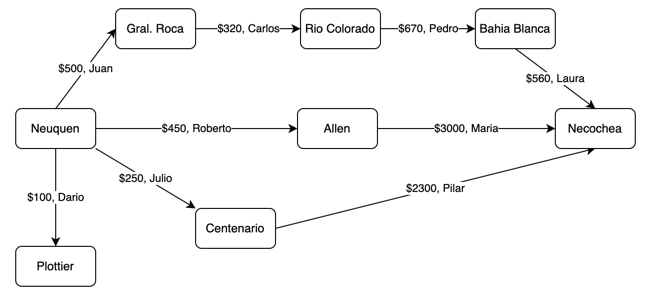
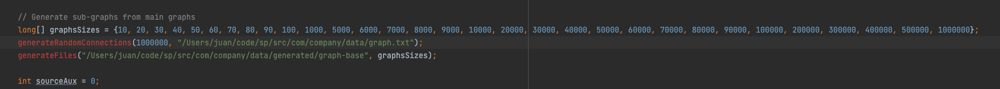
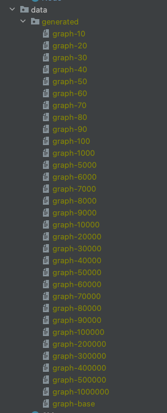
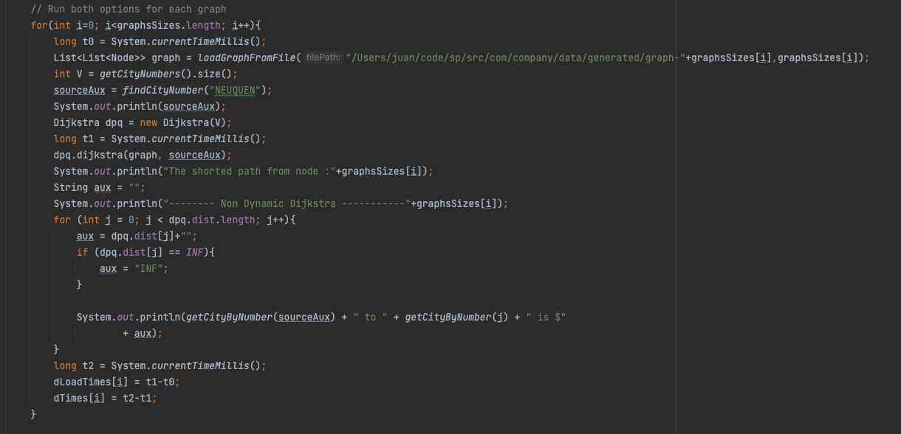
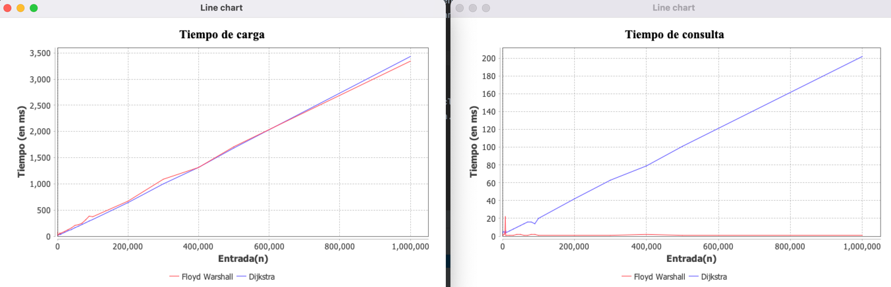

## Análisis de Algoritmos

### Programación dinámica

##### Juan J. Borja

### El dominio del problema

A modo lúdico con el objetivo de dotar de significado a los algoritmos se plantea una variación moderna del problema del viajero.

Las personas que viajan por argentina con espacio disponible en sus vehículos pueden registrar en la aplicación: La ciudad de donde parten
(origen), la ciudad a donde llegan (destino), el monto que desean cobrar por ese tramo y su nombre.

Quienes desean viajar y no disponen de un vehículo, pueden ingresar la ciudad desde la que desea partir y recibirán un listado
de todos los destinos posibles con su costo asociado (Si hubiera más de un camino hacia el mismo destino se listará el de menor precio)

### La estructura de datos

El problema se modeló utilizando grafos dirigidos utilizando una lista de listas de nodos.
```
List<List<Node>> Graph
```


### La entrada de datos

Los datos se ingresan en un archivo separado por comas en el orden: origen, destino, precio, persona

```
Neuquén, Gral Roca, 500, Juan
Gral Roca, Rio Colorado, 300, Carlos
Río Colorado, Bahía Blanca, 670, Pedro
Bahía Blanca, Necochea, 560, Laura
...
```

### Abstracción y modelado

Para pasar de la imagen anterior a la estructura de grafo que finalmente se almacena en la memoria
se realizan una serie de procesos.

- Se lee el archivo de entrada línea por línea y a cada ciudad que se lee por primer vez se le asigna un numero (loadCityNumbers en data/dataLoader.java)
- El proceso anterior ocurre dentro del proceso que transforma el archivo csv en la estructura del grafo (loadGraphFromFile en data/dataLoader.java)

Luego de este proceso se tendrá en memoria el Grafo cargado con las ciudades representadas con su número único asignado

### Datos utilizados

El archivo graph.txt cuenta con una entrada inicial de 104 conexiones. Además pueden generarse tantas conexiones como se desee
aleatoriamente. El algoritmo tomara una ciudad alaeatoria del archivo Cities.java y generara un valor aleatoriamente para el costo de la ruta
Esto ocurre en la función generateRandomConnections en dataLoader.java. La función espera como entrada la cantidad de conexiones y el archivo en que deben guardarse.

Con el fin de medir empíricamente los tiempos de ejecución se creó otra función que genera sub-grafos a partir del grafo generado anteriormente, esta
función se llama generateFiles y recibe como parámetros: la dirección del archivo con el grafo y un arreglo indicando las dimensiones de los subgrafos

Por ejemplo, para los graficos que se muestran en "El Resultado" de este documento, se utilizó un código similar a este:



De esta manera se agregaron a las 104 conexiones originales 1000000 de conexiones más y a partir de ese grafo inicial se generaron 31 sub-grafos (en nuevos graph-n.txt) de tamaño entre 10 y 1000000 
para a través de un bucle probar ambos algoritmos con los 31 sub-grafos de tamaño variable (n) 



En la siguiente imagen se puede ver la porción de código utilizada para ejecutar el algoritmo de Dijkstra, en cada uno de los sub-grafos. Un código similar fue utilizado para Floyd-Warshall. Notese que los tiempos t1 y t2 son tomados luego de la lectura del archivo para afectar la medición empírica lo menos posible.


### Los algoritmos utilizados

Teniendo en cuenta que la pregunta que queremos responder es: Dado que parto de una ciudad X a qué destinos puedo llegar gastando lo menos posible?
Elegimos para responder la pregunta dos algoritmos: Dijktra y Floyd-Warshall.
En el caso de Dijkstra cada vez que queremos saber la ruta más barata de una ciudad el algoritmo la calcula al momento de solicitarla,
Floyd-Warshall en cambio pre-calcula todas las rutas del grafo y al momento de consultarla sólo debe realizar la lectura.
Sería esperable entonces que el tiempo de carga del grafo sea inferior en Dijkstra que en Floyd-Warshall y que el tiempo de consulta
sea menos en Floyd-Warshall que en Dijkstra.

### La medición empírica

Para comprobar la hipótesis tomamos los sub-grafos generados y ejecutamos ambos algoritmos sobre estos algoritmos
midiendo los tiempos de carga y de consulta en ms. Almacenamos los resultados y los graficamos utilizando JfreeCharts

### El resultado

Obtenemos como resultado dos gráficos para comparar los algoritmos, uno del tiempo de carga y el otro del tiempo de consulta.
Podemos observar que contrario a lo esperado en cuanto a velocidad de carga se comportan de manera similar. En cuanto al tiempo de consulta, como esperábamos
Floyd-Warshall se mantiene prácticamente constante (No importa el tamaño del grafo sigue siendo un acceso a memoria) mientras que en el caso de Dijkstra crece con la entrada.



Como dijimos anteriormente sería esperable que el algoritmo de Floyd-Warshall tenga un orden superior en la carga dado que realiza el cálculo de todos los caminos posibles en este momento, y si bien
en distintas ejecuciones observamos que a veces uno es más 'rápido' que el otro ambos muestran una tendencia clara a O(n) en todas las ejecuciones. Entendemos que este comportamiento se debe a que el recorrido
del grafo (con un bucle n veces) es significativamente mucho más demandante en cómputo que la operación en sí.

En cuanto al 'tiempo de consulta' los resultados son similares a los esperados, de Floyd-Warshall se espera (y se verifica) un orden contante, O(1) debido a que los cálculos fueron realizados junto con la carga de datos y por lo tanto es solo un access a memoria.  
Mientras que Dijkstra, exhibe prácticamente un O(n) esto se debe a que el algoritmo está optimizado para hallar un camino más corto desde un vértice dado a otro y presenta un orden similar a O(log n), pero en este caso
al utilizarlo para hallar los n caminos posibles desde un vértice dado a los restantes el orden del algoritmo tiende a O(n).

A modo de conclusión podemos decir que para el problema planteado por nosotros:

'Quienes desean viajar y no disponen de un vehículo, pueden ingresar la ciudad desde la que desea partir y recibirán un listado
de todos los destinos posibles con su costo asociado (Si hubiera más de un camino hacia el mismo destino se listará el de menor precio)'

El algoritmo de Floyd-Warshall es el mas indicado porque muestra un orden de ejecución inferior. Pero, si en cambio, reformularíamos el problema en cuestión a:

'Dado que estoy en una ciudad X quiero llegar a una ciudad Y con el menor costo posible'.

Es probable que sea mejor utilizar el algoritmo de Dijkstra

### Cómo probarlo

Basta con clonar este proyecto y ejecutar la clase principal (Main.java). Está configurado para generar subgrupos de entre 10 y 1000000 de aristas, por lo tanto se deberán esperar
unos minutos para ver las gráficas en pantalla. 


